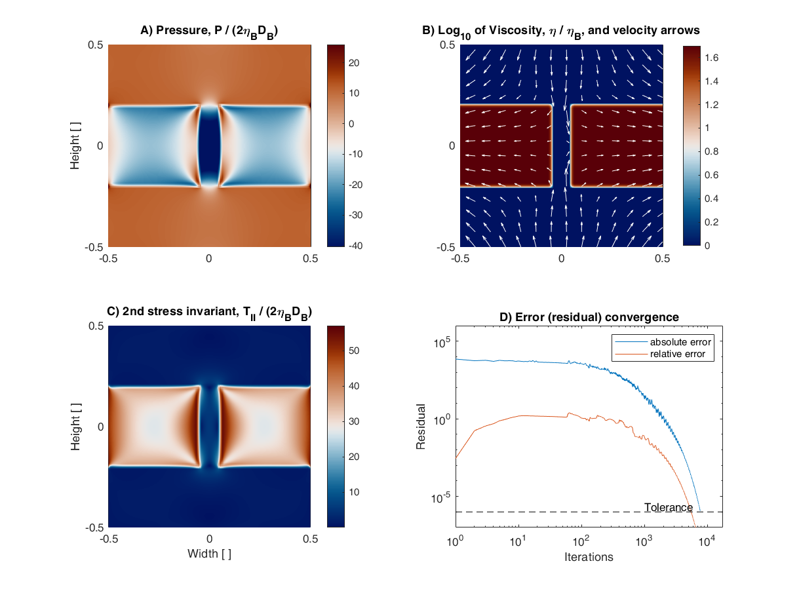

# A simple computer program for calculating stress and strain rate in 2D viscous inclusion-matrix systems
Iterative finite difference program for 2D viscous deformation.

Code versions for [Matlab](https://mathworks.com/en/products/matlab.html) and freely available [GNU Octave](https://octave.org/).

Published in [W.R. Halter, E. Macherel, and S.M. Schmalholz (2022) JSG](https://doi.org/10.1016/j.jsg.2022.104617).

- Some of our published model configurations can be found in [Examples_Matlab](/Examples_Matlab/) or [Examples_Octave](/Examples_Octave/) for didactical purpose and to ensure the reproducibility of our results.

- Some errors were found in the original version of the published code. 
The codes on this GitHub page were since corrected. The original (wrong) codes can still be looked at in the folder [Previous_code_versions](/Previous_code_versions/).
For more details about the errors in the previous code versions and their correction, check the [corrigendum 1](https://doi.org/10.1016/j.jsg.2022.104665) and corrigendum 2.

All codes on this page are free software under the Creative Commons CC-BY-NC-ND license.

### Pure shear vs. simple shear

Fig. 6a & 6b compare the two implemented boundary conditions. We chose a hard rectangular inclusion.  
Both codes are completely identical except for line 5

```matlab
ps          = 1;        % ps = 1 models pure shear; ps = 0 models simple shear
```

where in Fig. 6a we activate pure shear, whereas in Fig. 6b we activate simple shear.


### Linear viscous vs. power-law viscous

Fig. 8a & 8b compare the two implemented viscous rheologies. We chose a weak elliptical inclusion.  

In both figures the inclusion is linear viscous. In Fig. 8a, also the matrix is linear viscous, whereas in Fig. 8b the matrix uses a combined flow-law, including a power-law viscosity. More details about the chosen model configuration in Halter et al. 2022.  

Both codes are completely identical except for line 19

```matlab
n_exp       = 5;
```

where in Fig. 8b we chose a power-law exponent > 1. 


### Multiple inclusions

Fig. 9 illustrates the interaction between multiple inclusions. This model configuration is calculated on a higher resolution (901 x 601) and can take multiple hours to fully converge.


### Garnet

In Fig. 10 we want to investigate whether we can infer the pressure field inside and around a rigid garnet porphyroblast. To define the shape of the garnet we created a polygon using Matlab's [ginput](https://ch.mathworks.com/help/matlab/ref/ginput.html) function on a photo of a real rock.


Note the error convergence behaviour. In this example, the (absolute) error reaches a plateau before fully converging to the bottom. This behaviour is typical for the pseudo-transient method.

### Boudinage

In Fig. 11 we show the pressure and stress distribution inside and between 2 separating boudin blocks. Feel free to modify the code visualization to confirm that the horizontal total stress (Sxx) is indeed continuous across the weak gap, as discussed in Halter et al. 2022.




### Computation time

An overview of calculation times obtained on a commercial laptop (Lenovo ThinkPad P1 gen 3). 

| Model configuration                 | Resolution (nx,ny) | Tolerance | Computation time (seconds) |
|-------------------------------------|--------------------|-----------|----------------------------|
| Fig. 6a - Rectangle pure shear      | (201,201)          | 1e-6      |                       3397 |
| Fig. 6b - Rectangle simple shear    | (201,201)          | 1e-6      |                       3714 |
| Fig. 8a - Ellipse linear viscous    | (201,201)          | 1e-6      |                       4220 |
| Fig. 8b - Ellipes power-law viscous | (201,201)          | 1e-6      |                       4184 |
| Fig. 9 - Multiple inclusions        | (901,601)          | 1e-6      |                       TBD  |
| Fig. 10 - Garnet                    | (301,186)          | 1e-6      |                       7373 |
| Fig. 11 - Boudinage                 | (201,201)          | 1e-6      |                       4259 |

Note that there exist other codes using different numerical approaches (e.g., [MDOODZ7.0](https://github.com/tduretz/MDOODZ7.0)) which are capable of solving the same problem much faster. However, as emphasized in Halter et al. 2022, the beauty in our code lies in it's simplicity and readability, making coding accessible and transparent.

Also note, that the computation time does not increase with non-linearity. I.e. the necessary computation time for Fig. 8b, using a non-linear rheology, is not higher than for Fig. 8a, using a linear rheology. This illustrates the potential of the pseudo-transient method for solving non-linear problems. A more efficient, accelerated pseudo-transient method, used in high performance computing, is assessed and explained in [Räss et al. 2022](https://doi.org/10.5194/gmd-15-5757-2022).

Our code can serve as an educational basis for the understanding of such an accelerated pseudo-transient method.

